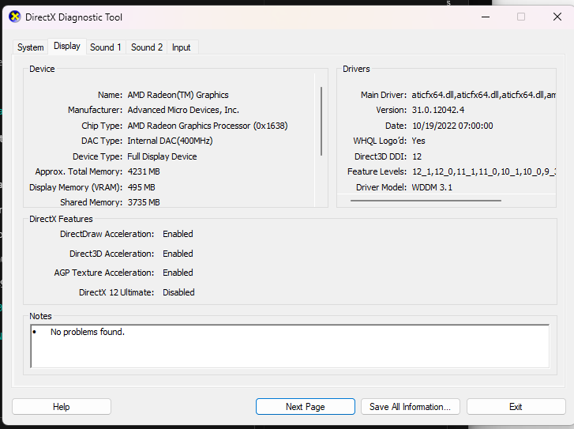
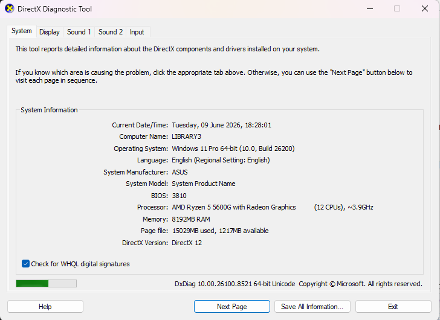

# Tugas 10 - Advanced RecyclerView

## Identitas
- **Nama**: Fatih Jawwad Al Mumtaz
- **NIM**: 452024611047
- **Kelas**: A2
- **Mata Kuliah**: Pemrograman Perangkat Bergerak
- **Universitas**: Universitas Darussalam Gontor

## Fitur

1. **ListAdapter + DiffUtil** — Adapter pake ListAdapter, jadi pas data di-update, yang dirender ulang cuma item yang beneran berubah. Nggak kayak adapter biasa yang notifyDataSetChanged dan reload semua.

2. **Multiple View Types** — Ada 2 jenis item:
   - **Header** — full-width (span 2), background warna solid, buat judul kategori
   - **Data** — 1 kolom (span 1), ada lingkaran warna + label

3. **GridLayoutManager + SpanSizeLookup** — Grid 2 kolom. Header ambil 2 span (full-width), data item ambil 1 span.

4. **Custom BindingAdapter** — Bikin `@BindingAdapter("app:backgroundColor")` biar bisa set background warna langsung dari XML.

5. **ViewHolder Factory** — Tiap ViewHolder punya companion object `create()` buat nge-inflate layout, biar konstruktornya bersih.

## Screenshot

*GridView 2 kolom, header warna biru/hijau/oranye/ungu*

*Data berubah, item yg sama nggak ke-rebind*

## RecyclerView.Adapter vs ListAdapter — Bedanya?

**Adapter biasa** pas data berubah bakal manggil `notifyDataSetChanged()`. Efeknya? Semua item yang kelihatan di layar di-render ulang dari nol. Padahal mungkin cuma 1 item yang berubah. Boros banget.

**ListAdapter** pake `DiffUtil.ItemCallback` yang kerja di background thread buat ngitung mana item yang beda antara list lama dan baru. Hasilnya:
- `notifyItemChanged()` — cuma item yang berubah aja yang di-rebind
- `notifyItemInserted()` — item baru dapet animasi masuk
- `notifyItemRemoved()` — item ilang dapet animasi keluar

Jadi pas tombol **Refresh** diteken, DiffUtil cuma touch item-item yang beda. Sisanya diemin aja. Efisien banget apalagi kalo datanya banyak.

## Tech Stack
- Kotlin
- RecyclerView (ListAdapter + DiffUtil)
- GridLayoutManager + SpanSizeLookup
- Multiple View Types
- DataBinding + Custom BindingAdapter
- Material Design 3 (CardView, FAB, Toolbar)
